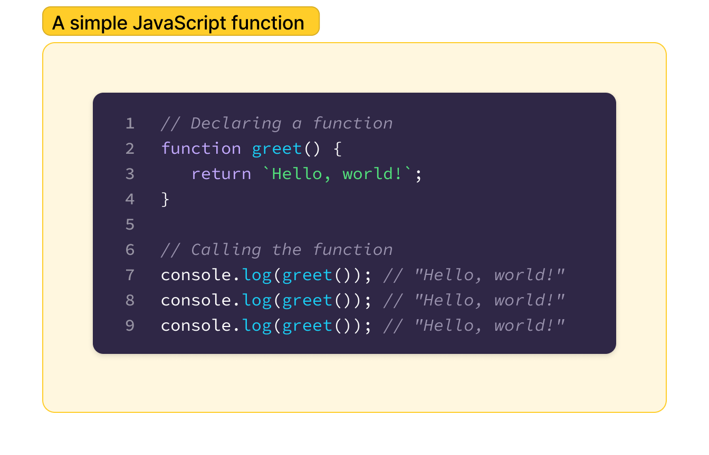
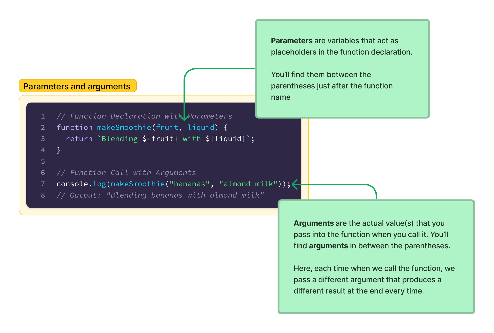
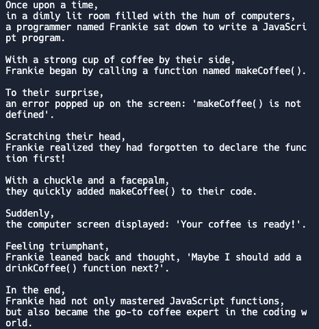

# Functions in JS

## Basic functions

 - **Functions** are just little packages of code that can be called over and over again
 - **Define** or **declare** a function that returns a particular value (in this case a string – notice the backticks: **``**).



We can then **call** the function anywhere it is needed, and the same code will be run each and every time, as it is in the screnshot above.

> ## Challenge
> Open [index.js](img/index.js)
> 
> 1. After correctly sequencing the story from the activity [here](https://www.figma.com/file/dGLxKwiXFoYWvUeod9eUZD/A-Tale-of-Fire-and-Functions-(Start)/duplicate), **declare** a new function inside `index.js` called `tellStory()`
> 2. Write a function called `tellStory` that tells the whole story, in the correct order, in a single string using backticks (**``**).
> 3. `return` this string from the function.
> 4. Run the script by clicking the 'Run' button at the top of your window. You should see the entire story printed to the Console window on your right. It should look like this:
> 

## Parameters and arguments

**Parameters** are variables that act as placeholders in the function declaration. You’ll find them between the parentheses just after the function name.

Think of **parameters** like the recipe for a smoothie: "You need some `fruit` and some `liquid`.”


**Arguments** are the actual value(s) that you pass into the function when you call it. You’ll find arguments in between the parentheses.

**Arguments** are like the actual ingredients you use when making an actual smoothie: "Today, I'll use bananas and almond milk."

Above, when we call the function, we pass custom arguments that produces a different result every time.

> ## Challenge
> 1. Still inside [index.js](index.js), declare a second function called `tellCustomStory()`.
> 2. Add a parameter to your new function called `name`:
> ```javascript
> function tellCustomStory() {
>   // Your code here  
> }
> ```
> 3. Interpolate this new parameter into your story using a template literal, replacing the name 'Jamie' with the value you are passing in.
> 4. Click 'Run'. You should see the output below in your Console (this will be at the bottom under your original story):
> 
> 5. In the 'Tools' panel to your bottom left, click the "☑️ Tests" button. Then click "▶️ Run Tests" in the Tests panel that has appeared. Make sure all your tests pass in the Console:
> 
> 6. If all tests pass, click the Submit button to the top right of your screen.