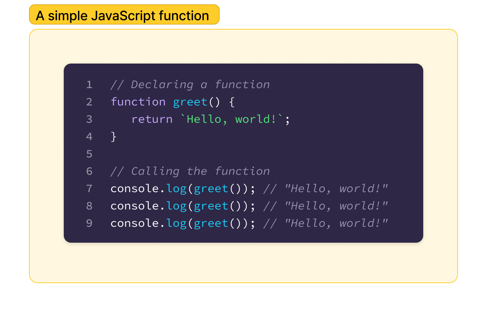
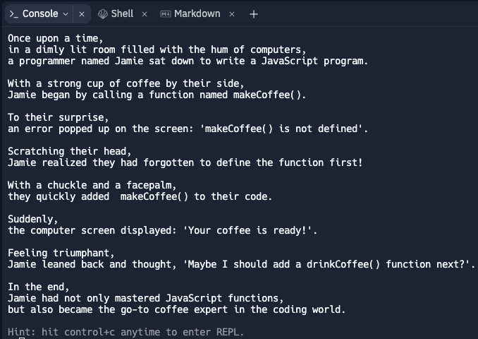

# Functions in JS

## Basic functions

 - **Functions** are just little packages of code that can be called over and over again
 - **Define** or **declare** a function that returns a particular value (in this case a string – notice the backticks: **``**).

We can then **call** the function anywhere it is needed, and the same code will be run each and every time, as it is in the screnshot above.

> ## Task
> 1. Open [index.js](index.js)
> 2. After correctly sequencing the story from the activity [here](https://www.figma.com/file/dGLxKwiXFoYWvUeod9eUZD/A-Tale-of-Fire-and-Functions-(Start)/duplicate), **declare** a new function inside `index.js` called `tellStory()`
> 3. Write a function called `tellStory` that tells the whole story in a single string using backticks (**``**).
> 4. `return` this string from the function.
> 6. Run the script by clicking the 'Run' button at the top of your window. You should see the entire story printed to the Console window on your right. It should look like this:
> 

## Parameters and arguments